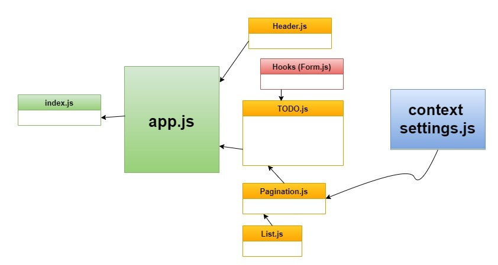

# To Do App

# LAB 31 - Context API

- one way of using global states in React by using context API. that done by creating, providing, wrapping, and consumming the context.

- useForm is a custom hook that contains a function that will be called when you click on the submit button, and will handle onSumbit and onchange functions.

### Description : this phase was refactoring TO DO App by :

#### 1. adding a global state by context-API

#### 2. adding a pagination.

#### 3. adding style from BluePrint UI.

## PR link :

- [https://github.com/Ahmad-AbuOsbeh/todo-app/pull/1](https://github.com/Ahmad-AbuOsbeh/todo-app/pull/1)

## Deployed link :

- [https://todo-ahmad-abuosbeh.netlify.app/](https://todo-ahmad-abuosbeh.netlify.app/)

## UML :

- 
