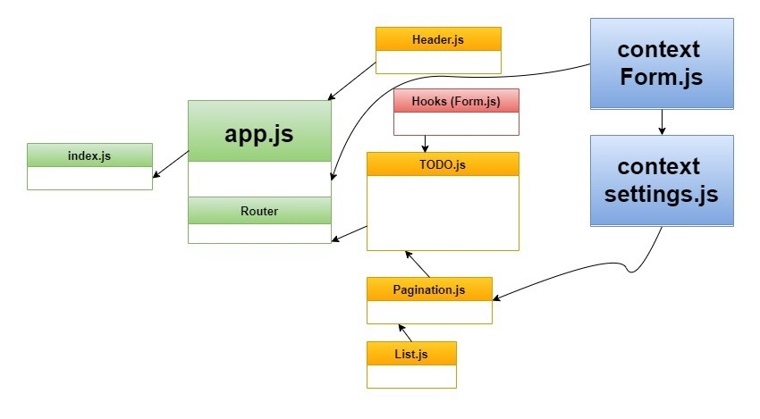
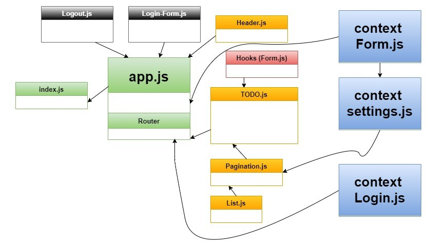
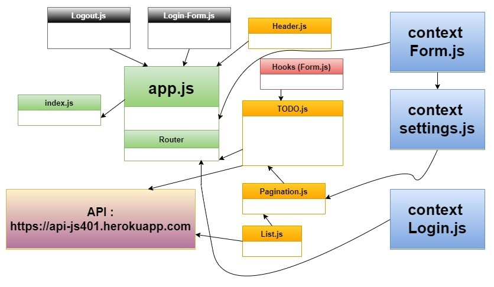

# To Do App

# LAB 31 - Context API

- one way of using global states in React by using context API. that done by creating, providing, wrapping, and consumming the context.

- useForm is a custom hook that contains a function that will be called when you click on the submit button, and will handle onSumbit and onchange functions.

### Description : this phase was refactoring TO DO App by :

#### 1. adding a global state by context-API

#### 2. adding a pagination.

#### 3. adding style from BluePrint UI.

## PR link :

- [https://github.com/Ahmad-AbuOsbeh/todo-app/pull/1](https://github.com/Ahmad-AbuOsbeh/todo-app/pull/1)

## Deployed link :

- [https://todo-ahmad-abuosbeh.netlify.app/](https://todo-ahmad-abuosbeh.netlify.app/)

## UML :

- 

 

# LAB 32 - Context API - Behaviors

### Description : this phase was refactoring and editing on TO DO App by :

#### 1. converting all class components to functional ones.

#### 2. adding settings to edit and control the context.

#### 3. save the selection to local storage.

#### 4. using React Browser Routes.

## PR link :

- [https://github.com/Ahmad-AbuOsbeh/todo-app/pull/2](https://github.com/Ahmad-AbuOsbeh/todo-app/pull/2)

## Deployed link :

- [https://todo-ahmad-abuosbeh.netlify.app/](https://todo-ahmad-abuosbeh.netlify.app/)

## UML :

- 

 

# LAB 33 - Login and Auth

### Description : this phase was refactoring and editing on TO DO App by :

#### 1. adding sign in and sign up connected to real API.

#### 2. add basic and bearer auth.

#### 3. feature customization based on user role and capability.

## PR link :

- [https://github.com/Ahmad-AbuOsbeh/todo-app/pull/3](https://github.com/Ahmad-AbuOsbeh/todo-app/pull/3)

## Deployed link :

- [https://todo-ahmad-abuosbeh.netlify.app/](https://todo-ahmad-abuosbeh.netlify.app/)

## UML :

- 

 

# LAB 34 - API Integration

### Description : this phase was refactoring and editing on TO DO App by :

#### 1. connect all CRUD operations to real API.

#### 2. activate the delete feature for the admin only.

## PR link :

- [https://github.com/Ahmad-AbuOsbeh/todo-app/pull/4](https://github.com/Ahmad-AbuOsbeh/todo-app/pull/4)

## Deployed link :

- [https://todo-ahmad-abuosbeh.netlify.app/](https://todo-ahmad-abuosbeh.netlify.app/)

## UML :

- 
